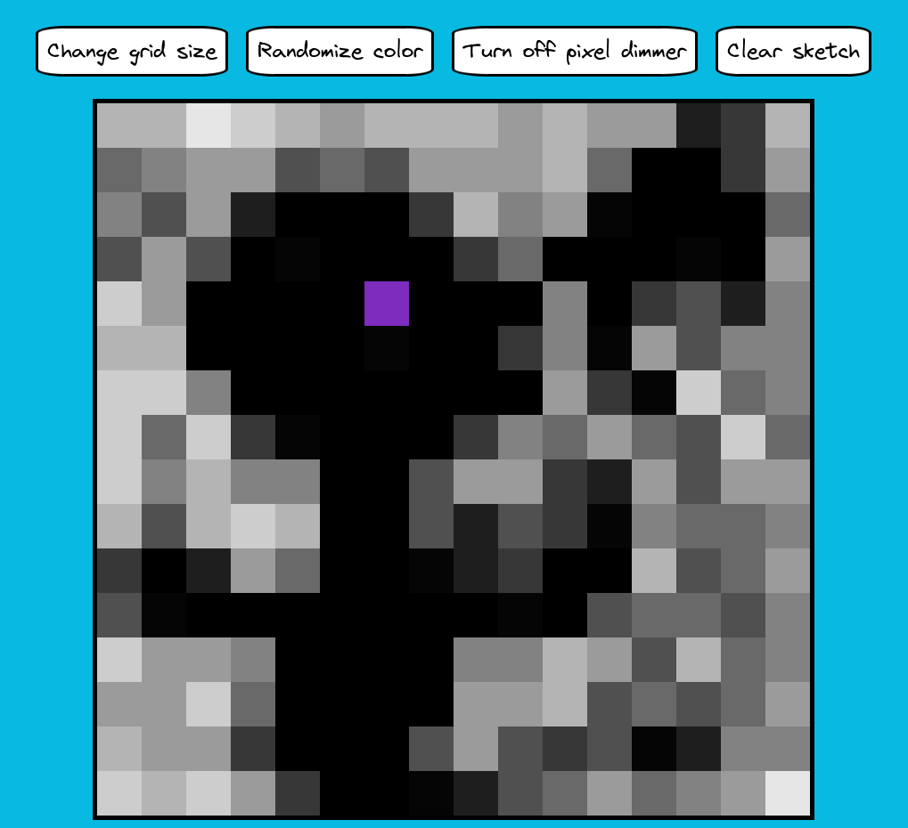

# etch-a-sketch

A browser version of something between a sketchpad and an Etch-A-Sketch.

### Design:

### Available features:

- Change sketchpad pixel amount per each row. It doesn't change the size of the sketchpad overall, just resizes the pixels to fit them into the sketchpad.  ATTENTION! THIS FEATURE RESETS ALL PIXELS TO WHITE.
- Pixel color randomization. Each pixel color generated randomly.
- Pixel dimming. A progressive darkening effect where each interaction darkens the pixel by 10%.
- Clear sketchpad. Resets the color of all pixels to white.

### Tech stack:

1. HTML/CSS
2. JS (DOM API)

### What did I learn from this project:

- I've practiced a lot with the Javascript DOM API. Especially with mouse events.
- Tried to conform to the clean code principles
- Revised some CSS stuff.
- Practiced the idea of atomic commits.

### Challenges that I faced:

1. The most confusing challenge for me was fixing the bug that was caused by 'drag' event in the browser. Before this bug I didn't know that this event even exist :) . When user was drawing by pressing mouse button down, there was a situation when he could drag that pixel and activate 'dragstart' event. Because that event started the 'mouseup' event didn't activated and the program continued to color pixels even when the 'mousedown' event wasn't activated. The solution was pretty simple, but it took some time to localize and understand the problem.
2. Second challenge was when I decided that I don't want to allow the user to activate random color and pixel dim instruments together, when I activate one, the second should be disabled. First solution that I came up with was to send 'click' event to the second instrument if it was activated, but then I needed to also add same code to the current button in case of a mirror situation. This solution led to some strange result, that was pretty confusing to understand with my level of experience, so I came up with a simpler approach that works good enough.
